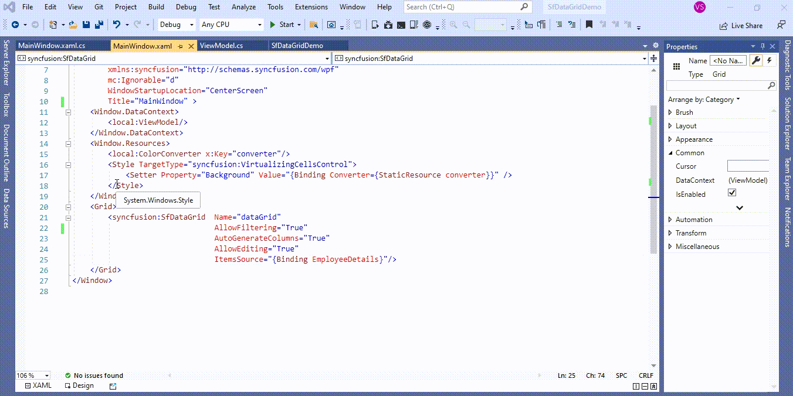
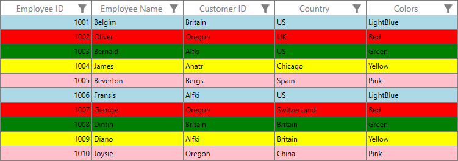

# How to change the cell background based on the cell value in WPF DataGrid (SfDataGrid)?

## About the sample
This example illustrates how to change the cell background based on the cell value in [WPF DataGrid](https://www.syncfusion.com/wpf-controls/datagrid) (SfDataGrid)? 

[WPF DataGrid](https://www.syncfusion.com/wpf-controls/datagrid) (SfDataGrid) record rows ([VirtualizingCellsControl](https://help.syncfusion.com/cr/wpf/Syncfusion.UI.Xaml.Grid.VirtualizingCellsControl.html)) can be customized conditionally by changing its property value based on ‘cell value’ or ‘data object’ by using converter, where converter returns the value based on Underlying record.

Here, rows background is changed using converter, where converter returns the color value based on Colors property of underlying record.

```XML

<Window.Resources>
        <local:ColorConverter x:Key="converter"/>
        <Style TargetType="syncfusion:VirtualizingCellsControl">
            <Setter Property="Background" Value="{Binding Converter={StaticResource converter}}" />
        </Style>
</Window.Resources>

```

```C#

public class ColorConverter : IValueConverter
{
     public object Convert(object value, Type targetType, object parameter, CultureInfo culture)
     {
          //Get the DataRowView
          var dataRow = value as DataRowView;

          //Get the colors name value
          var record = dataRow.Row["Colors"].ToString();

          //You can use a BrushConverter
          SolidColorBrush redBrush = (SolidColorBrush)new BrushConverter().ConvertFromString(record);

          //return the color based on DataBase cell value
          return redBrush;
     }

     public object ConvertBack(object value, Type targetType, object parameter, CultureInfo culture)
     {
          throw new NotImplementedException();
     }
}

```



The following screenshot shows the changed cell background based on the cell value,



Take a moment to peruse the [WPF DataGrid - Conditional Styling](https://help.syncfusion.com/wpf/datagrid/conditional-styling) documentation, where you can find about conditional styling with code examples.

## Requirements to run the demo
Visual Studio 2015 and above versions
